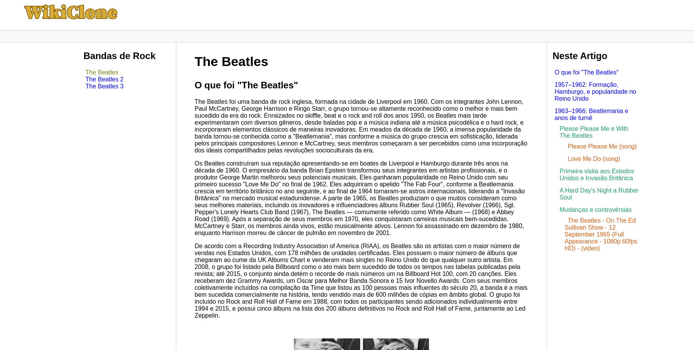

# WikiClone - Desafio de Projeto 3 - Recriando o wikipedia com uma estrutura mais moderna

Clone do site "Wikipedia" com uma estrutura mais moderna, semântica ao código e adição de mídias.

## Acesse a página: [https://murilomarsoli.github.io/html-dio-wikiclone/index.html](https://murilomarsoli.github.io/html-dio-wikiclone/index.html)

